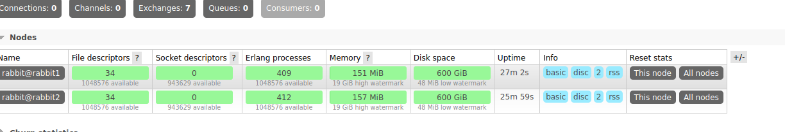
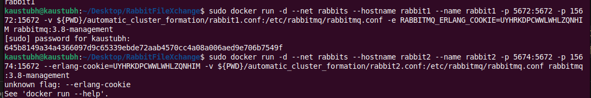

Plan to make this:

Producer side:
    node - express backend
    files in current repo.<>
    versioning of files done in current repo <>

Consumer side:
    node - express frontend
    files in current repo<>
    versioning of files done in current repo<>

    - producer request files and version from consumer
    - response file and version for consumer.
    - server compares local version and prepares a list of files to be sent. 
    - files sent over rabbit mq by server
    - consumer receives and updates it locally.
   
## Notes

### Clustering:

#### Manual clustering (rabbit1 and rabbit2 are the two clusters in use)

  - form a docker network:
      ```sudo docker network create <network>```
      
  - To connect multiple rabbit mq instances to form a cluster need to have the same RABBITMQ_ERLANG_COOKIE.
      
  - To generate the COOKIE, create an instance & run the following command
  ```sudo docker exec -it rabbit1 cat /var/lib/rabbitmq/.erlang.cookie```
          
  - Now instance new instances, with the same RABBITMQ_ERLANG_COOKIE. 
    
  - ```sudo docker run -d --net <network> --hostname rabbit1 --name rabbit1 -p 5672:5672 -p 15672:15672 -e RABBITMQ_ERLANG_COOKIE=<cookie> rabbitmq:3.8-management```

  - ```sudo docker run -d --net <network> --hostname rabbit2 --name rabbit2 -p 5672:5672 -p 15672:15672 -e RABBITMQ_ERLANG_COOKIE=<cookie> rabbitmq:3.8-management```

    #### To Join node2(rabbit2) & node1 (rabbit1)

  - docker exec -it rabbit2 rabbitmqctl stop_app
  - docker exec -it rabbit2 rabbitmqctl reset
  - docker exec -it rabbit2 rabbitmqctl join_cluster rabbit@rabbit1
  - docker exec -it rabbit2 rabbitmqctl start_app
  - docker exec -it rabbit2 rabbitmqctl cluster_status

- Result 

A tedious process.. everytime, if a instance goes down and up, it should automatically join the cluster. 

## Automatic clustering. 

- to give a configuration file stating the nodes in the cluster the current node should associate with onstart of the container.
- Adding the following argument to existing create docker container command.
 
- ```-v ${PWD}/automatic_cluster_formation/rabbit1.conf:/etc/rabbitmq/rabbitmq.conf ```



